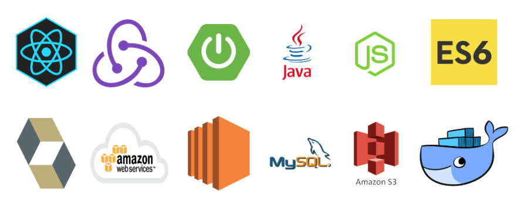
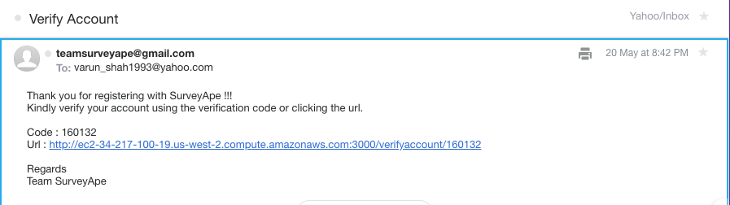
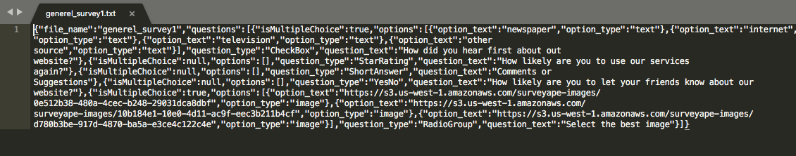
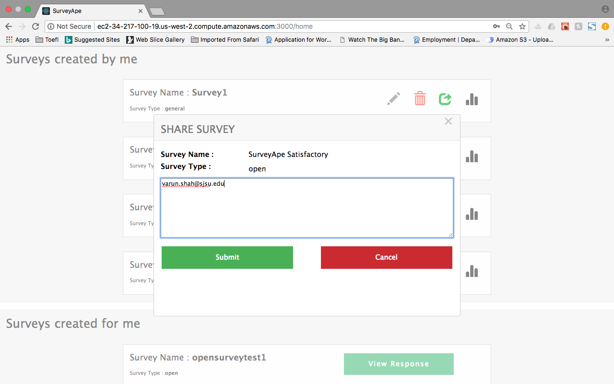
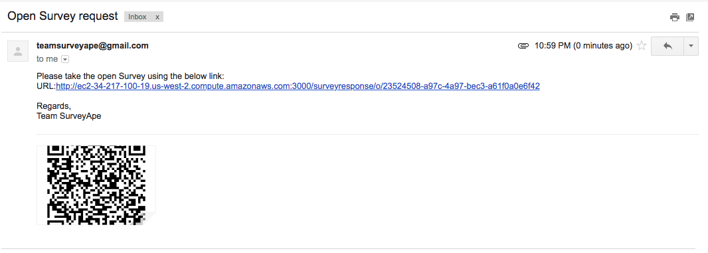
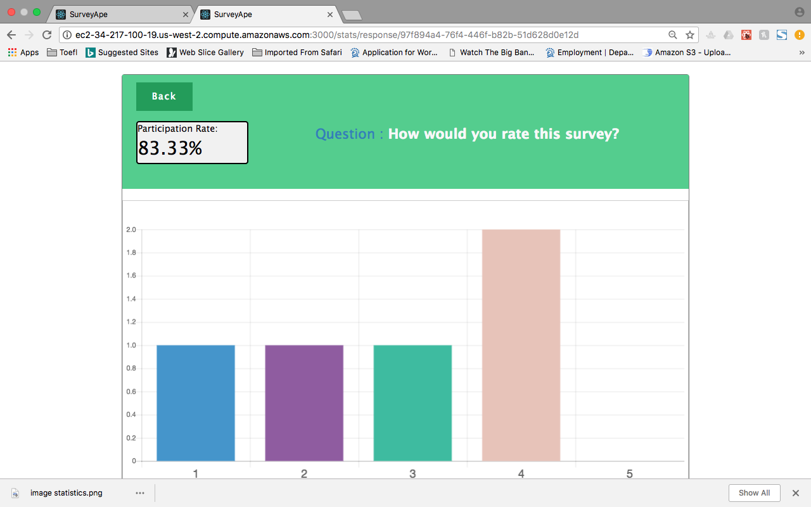
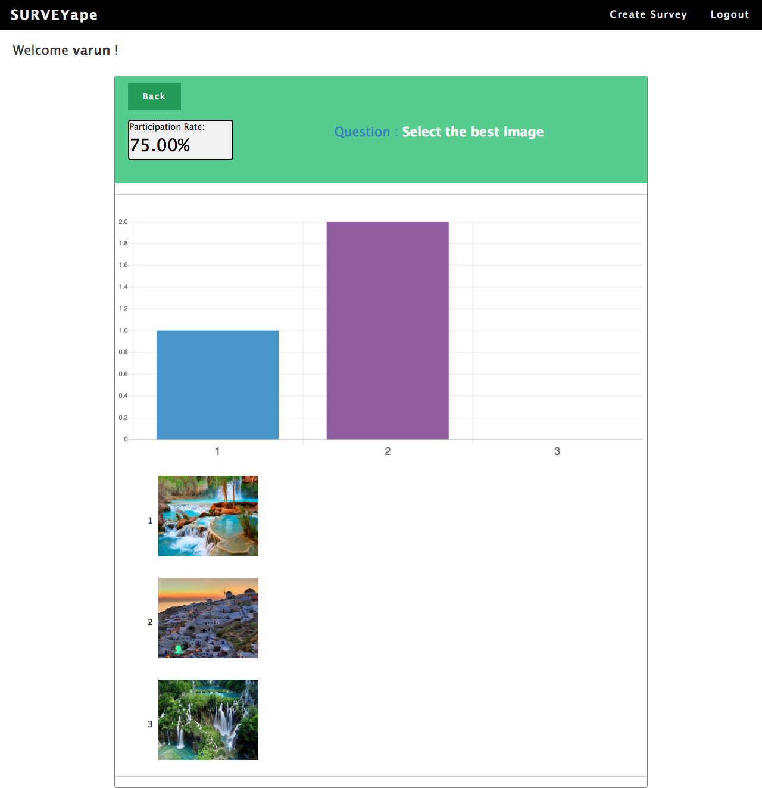

<link rel="stylesheet" href="readme-src/readme.css">

# SurveyApe

> Team project for Graduate software engineering course Enterprise Application Development.

## Goal

* The goal is to build a distributed enterprise web application which enables the user to become surveyor and surveyee. User can login and create surveys as a surveyor and ask others to provide their response. Surveyee does not have to be registered to participate in survey and can provide survey response.

* We were tasked with this project requirement so that we can learn and develop REST API enterprise application. 

## System Design

### Technology stack

 
<table>
<thead>
<tr>
<th>Area</th>
<th>Technology</th>
</tr>
</thead>
<tbody>
	<tr>
		<td>Front-End</td>
		<td>React, Redux, React Router, Bootstrap, HTML5, CSS3, Javascript ( ES6 )</td>
	</tr>
	<tr>
		<td>Analytics Graphs</td>
		<td>chart.js</td>
	</tr>
	<tr>
		<td>Back-End</td>
		<td>Spring Boot (Hibernate, JPA, AOP) </td>
	</tr>
	<tr>
		<td>API Testing</td>
		<td>JUnit, Postman</td>
	</tr>
	<tr>
		<td>Database</td>
		<td>MySQL (AWS RDS)</td>
	</tr>
	<tr>
		<td>Image File Storage</td>
		<td>AWS S3 Bucket</td>
	</tr>
    <tr>
		<td>Deployment</td>
		<td>AWS EC2</td>
	</tr>
</tbody>
</table>
 

### Database

> Database design and the data was critical for the project so To maintain consistency within team we deployed our database on AWS RDS (MySQL).

## Screenshots

#### Login/Signup

#### Email Account Verification Email

#### User Dashboard

#### Create Survey

#### Survey Builder

#### Export Survey

##### Exported file JSON data

#### Import Survey

##### Before Import Survey

##### After Import Survey

#### Invite Users for participating in Survey

#### Participation Link with QR Code for different type of surveys
##### General Survey

##### Open Survey

##### Closed Survey

#### Survey Response Page for Survey participant

#### Readonly Survey Response for submitted response

#### Survey Statistics Dashboard

#### Statistics for Question Types (Checkbox, Radio, Dropbox, YESNO, Rating)

#### Statistics for Question Types (Short Answers, DateTime)

## Team Members

*	Arijit Mandal
*	Rutvik Pensionwar
*	Sannisth Soni
*	Varun Shah
