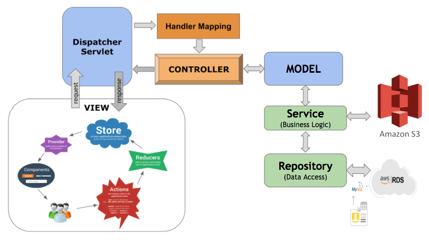

<link rel="stylesheet" href="readme-src/readme.css">

# Online Travel Reservation

> Team project for Graduate software engineering course Enterprise Distributed Systems.

## Goal

* The goal is to build a distributed enterprise web application which enables the user not only to search for Cars, Hotels and Flights and make a booking but also login/signup along with editing user preferences and viewing travel history. As well as create a Admin side which can be used to add/edit/delete Flights, Cars and Hotels and also be able to delete the user and view the analytics/statistics.

* We were tasked with this project requirement so that we can learn and develop enterprise MERN stack applications with the use of distributed publish-subscribe messaging system like Apache Kafka along with a variety of other technologies like Elasticsearch, redis, mocha, etc.

## System Design

### Technology stack

 
<table>
<thead>
<tr>
<th>Area</th>
<th>Technology</th>
</tr>
</thead>
<tbody>
	<tr>
		<td>Front-End</td>
		<td>React, Redux, React Router, Bootstrap, HTML5, CSS3, Javascript ( ES6 )</td>
	</tr>
	<tr>
		<td>Analytics Graphs</td>
		<td>chart.js</td>
	</tr>
	<tr>
		<td>Back-End</td>
		<td>Spring Boot</td>
	</tr>
	<tr>
		<td>API Testing</td>
		<td>JUnit, Postman</td>
	</tr>
	<tr>
		<td>Database</td>
		<td>MySQL (AWS RDS)</td>
	</tr>
	<tr>
		<td>Image File Storage</td>
		<td>AWS S3 Bucket</td>
	</tr>
    <tr>
		<td>Deployment</td>
		<td>AWS EC2</td>
	</tr>
</tbody>
</table>
 

## Team Members

*	Arijit Mandal
*	Rutvik Pensionwar
*	Sannisth Soni
*	Varun Shah